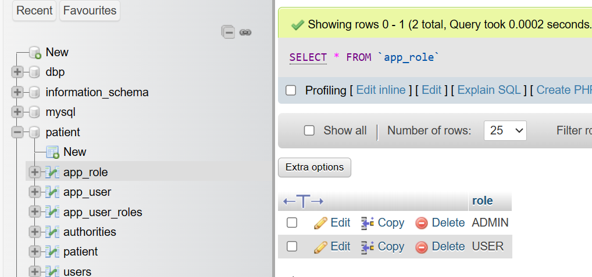

# Projet Spring MVC avec Thymeleaf et Sécurité

## Introduction

Ce projet constitue une application web de gestion sécurisée des patients (CRUD), construite à l'aide des frameworks Spring MVC, Thymeleaf, et Spring Security. L'objectif est de fournir une démonstration pratique de la manière dont ces technologies peuvent être utilisées pour créer une application web robuste, fonctionnelle, et sécurisée.

## Enoncé
Créer une application Web JEE basée sur Spring MVC, Thylemeaf et Spring Data JPA qui permet de gérer les patients. L'application doit permettre les fonctionnalités suivantes :
- Stocker dans H2 DataBase puis dans MySQL
- Afficher les patients
- Faire la pagination
- Chercher les patients
- Ajouter un patient
- Modifier un patient
- Supprimer un patient
- Sécuriser les données des utilisateurs
- Gérer les droits d'accès

## Objectifs
1. Créer un projet spring boot avec les dépendances Web, Spring Data JPA, H2, Lombok, Thymeleaf et MySQL
  - Créer l'entité JPA Patient
  - Créer l'interface PatientRepository basée sur Spring Data
  - Configurer l'application pour se connecter soit à h2 Database ou à MySQL (application properties)
  - Créer le contrôleur Spring MVC
  - Créer les vues basées sur Thymeleaf

2. Sécuriser cette application en intégrant un système d'authentification basé sur Spring security avec les trois stratégies:
  - InMemoryAuthentication
  - JdbcAuthentication
  - UserDetailsService

## Conception

## Architecture du projet

L'architecture de l'application suit le modèle MVC (Modèle-Vue-Contrôleur), une approche de conception qui divise l'application en trois composants principaux pour une meilleure organisation et maintenabilité.

- **Entities (Entités)** : Le package `ma.nisrine.patients_mvc.entities` abrite la classe `Patient`, une entité JPA représentant les informations d'un patient. Les annotations telles que `@Entity` et `@Id` sont utilisées pour définir son rôle en tant qu'entité persistante.

- **Repositories (Répertoires)** : Dans le package `ma.nisrine.patients_mvc.repositories`, l'interface `PatientRepository` étend `JpaRepository`, qui offre des méthodes prêtes à l'emploi pour effectuer des opérations CRUD sur l'entité `Patient`. Cela simplifie l'interaction avec la base de données.

- **Web** : Le package `ma.nisrine.patients_mvc.web` contient le contrôleur principal, `PatientController`. Ce contrôleur gère les requêtes HTTP, interagit avec la couche de service, et contrôle le flux entre le modèle (entités) et la vue (templates Thymeleaf).

- **Application** : La classe principale `PatientsMvcApplication` dans le package `ma.nisrine.patients_mvc` est annotée avec `@SpringBootApplication` et sert de point d'entrée pour l'application Spring Boot. La méthode `CommandLineRunner` pré-remplit la base de données avec des données de test lors du démarrage.

- **Templates** : Les fichiers HTML dans `src/main/resources/templates` utilisent Thymeleaf pour afficher dynamiquement les données sur les pages web. Thymeleaf est un moteur de template qui facilite l'intégration des données avec le code HTML.
  

## __Fonctionnalités__

### Page d'accueil
- La page d'accueil redirige automatiquement vers la liste paginée des patients.

### Liste des Patients
- Affiche une liste paginée des patients.
- Permet la recherche de patients par prénom.
- Permet la suppression d'un patient.
- Permet la modification des détails d'un patient.
  

### Ajout d'un Patient
- Accédez au formulaire pour ajouter un nouveau patient.
  
  

### Modification d'un Patient
- Accédez au formulaire pour modifier les détails d'un patient existant.
  

### Chercher un Patient
- On peut chercher n'importe quel patient
  

# Configuration de Spring Security

La sécurité applicative se résume à deux problèmes plus ou moins indépendants :
- l'authentification (qui êtes-vous ?)
- l'autorisation (qu'êtes-vous autorisé à faire ?) ou "contrôle d'accès"

Spring Security a une architecture conçue pour séparer l'authentification de l'autorisation et offre des stratégies extensibles pour les deux.

**Authentification_Spring Security avec JWT**

Pour une application sécurisée, on ajoute la dépendance de "spring-boot-starter-security".

Si on inspecte, on remarque qu'il y a un CSRF dans le champ du mot de passe.

Il est souvent utilisé pour intégrer un jeton anti-CSRF dans le formulaire de la page.
Les jetons anti-CSRF  sont  généralement utilisés  pour se protéger contre les attaques CSRF.

Lorsqu'on soumette un formulaire sur une page web, le serveur inclut souvent un jeton CSRF unique
dans ce formulaire. Il est ensuite vérifié par le serveur pour s'assurer que la
requête provient bien du formulaire généré par le serveur et non d'une attaque CSRF.

* **Authentification_Admin :**
  
Admin a le droit de:
* Consulter
* Modifer
* Supprimer
* Chercher
* Ajouter de nouveaux patients

Pour l'ajout des patient il ne peut pas faire le save du formulaire alors que les champs sont encore vides cela est appelé:
* **Validation des données**
Se fait comme suite:
1. Ajout de l'annotation de validation Spring : `@Valid`
2. Ajout des annotations de validation appropriées sur les champs concernés.
3. Au niveau du contrôleur, utilisation de `@Valid` et de l'objet `BindingResult` pour gérer les résultats de la validation.
4. Enfin, au niveau du code HTML, utilisation de l'expression Thymeleaf `th:errors` pour afficher les messages d'erreur en cas de validation échouée.

  

* **Authentification_User :**
  
  il a le droit de:
* Consulter
  
* Chercher
  
  **NB:**
  l'administrateur a des droits spéciaux qui permettent la suppression, la modification et l'ajout, tandis
  qu'un utilisateur ordinaire n'a pas ces droits et recevra une alerte s'il essaie de les exercer.
  

Il est utilisé pour intégrer un jeton anti-CSRF dans le formulaire de
l'authentification. Les jetons  anti-CSRF
sont généralement pour se protéger contre les attaques CSRF.

On a ajouté le dossier security qui contient les éléments suivants :

## Base de données 
Notre projet peut fonctionner soit avec la base de données H2 ou MySQL comme il est montré au dessous:

Notre base de données utilisée MySQL :

* Table patient
  
* Table app_user_roles
  
* Table app_user
  
* Table app_role
  

## Contenu du pom.xml

## Technologies utilisées
- **Spring Boot** : Un framework facilitant le développement d'applications Java avec une configuration minimale.
- **Spring MVC** : Un module de Spring Framework pour le développement d'applications web basées sur le modèle MVC.
- **Thymeleaf** : Un moteur de template pour la création de pages HTML dans des applications web basées sur Java.
- **Spring Security** : Un module de sécurité robuste pour les applications Spring.
- **Hibernate (JPA)** : Une implémentation de JPA pour la persistance des données en base de données relationnelle.
- **Bootstrap** : Un framework CSS pour la création d'interfaces web esthétiques et réactives.
- **MySQL** : Un système de gestion de base de données relationnelle.
- **Webjars** : Des bibliothèques JavaScript et CSS empaquetées dans des JAR qui peuvent être facilement incluses dans vos projets Spring Boot.
- **H2 Database** : Une base de données en mémoire qui peut être utilisée pour le développement et les tests.
- **Lombok** : Une bibliothèque Java qui simplifie le développement en ajoutant des annotations pour générer automatiquement du code boilerplate.

## Conclusion

Ce projet démontre la mise en place d'une application web sécurisée de gestion des patients en utilisant les technologies Spring MVC, Thymeleaf, et Spring Security. La séparation des préoccupations grâce à l'architecture MVC, l'intégration de la sécurité avec Spring Security, et l'utilisation de Thymeleaf pour la création de pages dynamiques contribuent à une application robuste et moderne. Ce projet peut servir de référence pour ceux qui cherchent à construire des applications web Java sécurisées et performantes.
